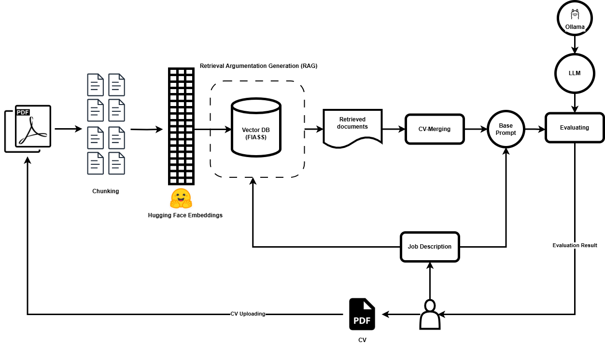

# ResumeRanker Documentation

## Overview

ResumeRanker is an LLM-powered application designed to rank resumes based on a given job description. It leverages various tools and libraries to process, evaluate, and rank resumes effectively.
## ResumeRanker Workflow

## Tools and Libraries

### 1. LangChain
LangChain is used for document processing and similarity search. It helps in extracting and processing text from uploaded resumes.

### 2. FAISS
FAISS (Facebook AI Similarity Search) is used to store and search resumes. It provides efficient similarity search capabilities to find the most relevant resumes based on the job description.

### 3. Streamlit
Streamlit is used to create the web interface for the application. It allows users to upload resumes, provide job descriptions, and view the ranked results.

### 4. PyPDF
PyPDF is used to extract text from PDF resumes. It helps in converting the uploaded PDF files into text format for further processing.

### 5. Hugging Face Transformers
Hugging Face Transformers library is used to leverage pre-trained language models for evaluating and ranking resumes. It provides the necessary tools to work with state-of-the-art NLP models.

### 6. Python-dotenv
Python-dotenv is used to manage environment variables. It helps in configuring the application settings through a `.env` file.

## Functionalities

### 1. Resume Upload
Users can upload resumes in PDF format through the web interface. The application extracts and processes the text from these resumes.

### 2. Job Description Input
Users can provide a job description against which the resumes will be evaluated and ranked.

### 3. Resume Storage and Search
The application stores the processed resumes in a FAISS vector database. It allows efficient similarity search to find the most relevant resumes based on the job description.

### 4. Resume Evaluation and Ranking
The application uses a pre-trained language model to evaluate and rank the resumes based on their relevance to the provided job description.

### 5. Results Display
The ranked resumes are displayed on the web interface, allowing users to view and analyze the results.

## How It Works

1. **Upload Resumes**: Users upload resumes in PDF format through the Streamlit web interface.
2. **Extract Text**: The application uses PyPDF to extract text from the uploaded resumes.
3. **Process Text**: The extracted text is processed using LangChain for document processing and similarity search.
4. **Store Resumes**: The processed resumes are stored in a FAISS vector database for efficient similarity search.
5. **Input Job Description**: Users provide a job description through the web interface.
6. **Evaluate and Rank**: The application uses a pre-trained language model from Hugging Face Transformers to evaluate and rank the resumes based on the job description.
7. **Display Results**: The ranked resumes are displayed on the Streamlit web interface for users to view and analyze.

## Conclusion

ResumeRanker leverages various powerful tools and libraries to provide an efficient and effective solution for ranking resumes based on job descriptions. It simplifies the process of finding the most relevant candidates for a given job, making it a valuable tool for recruiters and hiring managers.